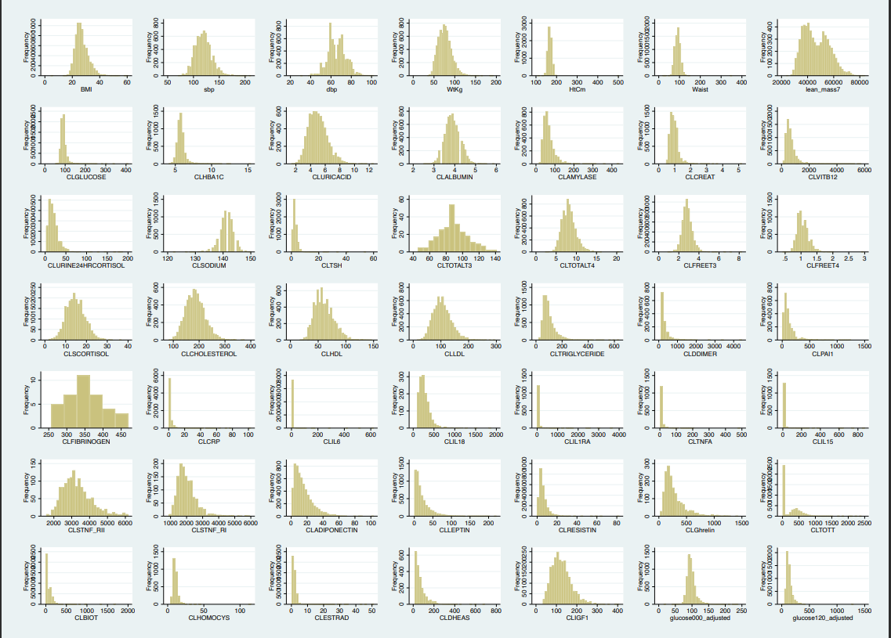
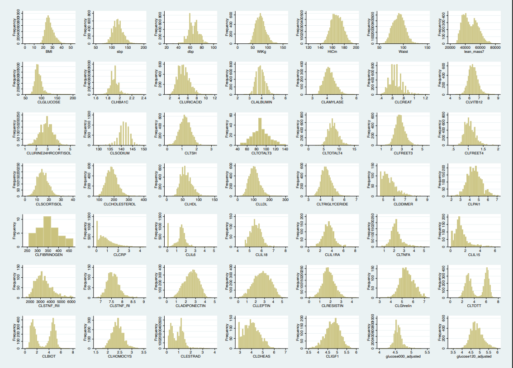
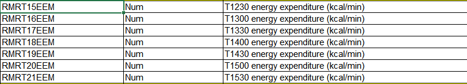

```{r setup, include=FALSE}
knitr::opts_chunk$set(echo = TRUE, warning = F, message = F)
library(tidyverse) # Data manipulations
library(patchwork) # Plot layouts
library(ggpubr) # Plot's coefficients
library(ggplot2) # Draw the plot
library(geepack) # GEE regression package
library(sjPlot) # GEE output table
library(readxl) # Import excel file
library(dplyr) # Data manipulations 
library(readr) # Import R. file
library(gt) # For the table generating
library(kableExtra) # For the table generating

# Source R.file:
source("BLSA_Final.R")
```

# Raw BLSA Dataset:

## 1. Check the Biomarkers' distributions for raw data:

{width=100%}

## 2. Log-transformed and get rid of the outliers:

$$ Rules :\begin{cases} X_{i} \geq\mu + 5\sigma  \rightarrow NA\\X_{i} \leq\mu - 5\sigma  \rightarrow NA\end{cases} $$

{width=100%}

## 3. Exponential it back and using clinical/percentile cutoffs to recode normal/abnormal for each of the biomarkers.

- Summary table for biomarkers:

```{r}
cor_table_2.1_df =   tibble(
  "Biomarker"  =    factor(c("Adiponectin",
                             "Adjusted Fasting Glucose",
                             "Albumin",
                             "Amylase",
                             "BMI",
                             "Waist circumference", 
                             "Bioavailable Testosterone",
                             "Cholesterol",
                             "Composed Systolic blood pressure (mmHg)",
                             "Composed Diastolic blood pressure (mmHg)",
                             "Core Body Temperature (F)",
                             "Creatinine, Serum",
                             "CRP",
                             "D Dimer",
                             "Dehydroepiandrosterone Sulfate",
                             "Estradiol",
                             "Fibrinogen",
                             "Free T3 (pg/ml)",
                             "Free T4 (ng/ml)",
                             "Ghrelin",
                             "HBA1C (%)",
                             "HDL-Cholesterol",
                             "Homocysteine",
                             "IL15", 
                             "IL18",
                             "IL6",
                             "IL1RA",
                             "insulin-like growth factor 1",
                             "LDL-Cholesterol",
                             "leptin",
                             "plasminogen activitor inhibitor 1",
                             "resistin",
                             "Serum cortisol (morning)",
                             "sodium",
                             "STNF-RI",
                             "STNF-RII",
                             "TNFA",
                             "Total T3",
                             "Total T4",
                             "Total testosterone",
                             "Triglycerides",
                             "TSH",
                             "uric acid",
                             "Urine24 cortisol, free (ug/24hrs)",
                             "VIT 12")),
  "Nonmissing obs N" =    c(N("adiponectin")$N_obs,
                            N("AFG")$N_obs,
                            N("albumin")$N_obs,
                            N("amylase")$N_obs,
                            N("bmi")$N_obs,
                            N("waist_circumference")$N_obs,
                            N("bio_testosterone")$N_obs,
                            N("cholesterol")$N_obs,
                            N("systolic_bp")$N_obs,
                            N("diastolic_bp")$N_obs,
                            N("corebody_temp")$N_obs,
                            N("creatinine_serum")$N_obs,
                            N("crp")$N_obs,
                            N("d_dimer")$N_obs,
                            N("dehy_sulfate")$N_obs,
                            N("estradiol")$N_obs,
                            N("fibrinogen")$N_obs,
                            N("free_t3")$N_obs,
                            N("free_t4")$N_obs,
                            N("ghrelin")$N_obs,
                            N("hba1c")$N_obs,
                            N("hdl")$N_obs,
                            N("homocysteine")$N_obs,
                            N("il15")$N_obs,
                            N("il18")$N_obs,
                            N("il6")$N_obs,
                            N("il1ra")$N_obs,
                            N("insu_gf")$N_obs,
                            N("ldl")$N_obs,
                            N("leptin")$N_obs,
                            N("pai")$N_obs,
                            N("resistin")$N_obs,
                            N("serum_cortisol")$N_obs,
                            N("sodium")$N_obs,
                            N("stnf_r1")$N_obs,
                            N("stnf_r2")$N_obs,
                            N("tnfa")$N_obs,
                            N("total_t3")$N_obs,
                            N("total_t4")$N_obs,
                            N("total_testosterone")$N_obs,
                            N("triglycerides")$N_obs,
                            N("tsh")$N_obs,
                            N("uric_acid")$N_obs,
                            N("ur24_cortisol")$N_obs,
                            N("vb12")$N_obs),
  "Nonmissing indi N" =    c(N("adiponectin")$N_indi,
                            N("AFG")$N_indi,
                            N("albumin")$N_indi,
                            N("amylase")$N_indi,
                            N("bmi")$N_indi,
                            N("waist_circumference")$N_indi,
                            N("bio_testosterone")$N_indi,
                            N("cholesterol")$N_indi,
                            N("systolic_bp")$N_indi,
                            N("diastolic_bp")$N_indi,
                            N("corebody_temp")$N_indi,
                            N("creatinine_serum")$N_indi,
                            N("crp")$N_indi,
                            N("d_dimer")$N_indi,
                            N("dehy_sulfate")$N_indi,
                            N("estradiol")$N_indi,
                            N("fibrinogen")$N_indi,
                            N("free_t3")$N_indi,
                            N("free_t4")$N_indi,
                            N("ghrelin")$N_indi,
                            N("hba1c")$N_indi,
                            N("hdl")$N_indi,
                            N("homocysteine")$N_indi,
                            N("il15")$N_indi,
                            N("il18")$N_indi,
                            N("il6")$N_indi,
                            N("il1ra")$N_indi,
                            N("insu_gf")$N_indi,
                            N("ldl")$N_indi,
                            N("leptin")$N_indi,
                            N("pai")$N_indi,
                            N("resistin")$N_indi,
                            N("serum_cortisol")$N_indi,
                            N("sodium")$N_indi,
                            N("stnf_r1")$N_indi,
                            N("stnf_r2")$N_indi,
                            N("tnfa")$N_indi,
                            N("total_t3")$N_indi,
                            N("total_t4")$N_indi,
                            N("total_testosterone")$N_indi,
                            N("triglycerides")$N_indi,
                            N("tsh")$N_indi,
                            N("uric_acid")$N_indi,
                            N("ur24_cortisol")$N_indi,
                            N("vb12")$N_indi),
  "Mean"  =               c(mean(blsa_clean$adiponectin, na.rm = T),
                            mean(blsa_clean$AFG, na.rm = T),
                            mean(blsa_clean$albumin, na.rm = T),
                            mean(blsa_clean$amylase, na.rm = T),
                            mean(blsa_clean$bmi, na.rm = T),
                            mean(blsa_clean$waist_circumference, na.rm = T),
                            mean(blsa_clean$bio_testosterone, na.rm = T),
                            mean(blsa_clean$cholesterol, na.rm = T),
                            mean(blsa_clean$systolic_bp, na.rm = T),
                            mean(blsa_clean$diastolic_bp, na.rm = T),
                            mean(blsa_clean$corebody_temp, na.rm = T),
                            mean(blsa_clean$creatinine_serum, na.rm = T),
                            mean(blsa_clean$crp, na.rm = T),
                            mean(blsa_clean$d_dimer, na.rm = T),
                            mean(blsa_clean$dehy_sulfate, na.rm = T),
                            mean(blsa_clean$estradiol, na.rm = T),
                            mean(blsa_clean$fibrinogen, na.rm = T),
                            mean(blsa_clean$free_t3, na.rm = T),
                            mean(blsa_clean$free_t4, na.rm = T),
                            mean(blsa_clean$ghrelin, na.rm = T),
                            mean(blsa_clean$hba1c, na.rm = T),
                            mean(blsa_clean$hdl, na.rm = T),
                            mean(blsa_clean$homocysteine, na.rm = T),
                            mean(blsa_clean$il15, na.rm = T),
                            mean(blsa_clean$il18, na.rm = T),
                            mean(blsa_clean$il6, na.rm = T),
                            mean(blsa_clean$il1ra, na.rm = T),
                            mean(blsa_clean$insu_gf, na.rm = T),
                            mean(blsa_clean$ldl, na.rm = T),
                            mean(blsa_clean$leptin, na.rm = T),
                            mean(blsa_clean$pai, na.rm = T),
                            mean(blsa_clean$resistin, na.rm = T),
                            mean(blsa_clean$serum_cortisol, na.rm = T),
                            mean(blsa_clean$sodium, na.rm = T),
                            mean(blsa_clean$stnf_r1, na.rm = T),
                            mean(blsa_clean$stnf_r2, na.rm = T),
                            mean(blsa_clean$tnfa, na.rm = T),
                            mean(blsa_clean$total_t3, na.rm = T),
                            mean(blsa_clean$total_t4, na.rm = T),
                            mean(blsa_clean$total_testosterone, na.rm = T),
                            mean(blsa_clean$triglycerides, na.rm = T),
                            mean(blsa_clean$tsh, na.rm = T),
                            mean(blsa_clean$uric_acid, na.rm = T),
                            mean(blsa_clean$ur24_cortisol, na.rm = T),
                            mean(blsa_clean$vb12, na.rm = T)),
  "Standard deviation" =   c(sd(blsa_clean$adiponectin, na.rm = T),
                             sd(blsa_clean$AFG, na.rm = T),
                             sd(blsa_clean$albumin, na.rm = T),
                             sd(blsa_clean$amylase, na.rm = T),
                             sd(blsa_clean$bmi, na.rm = T),
                             sd(blsa_clean$waist_circumference, na.rm = T),
                             sd(blsa_clean$bio_testosterone, na.rm = T),
                             sd(blsa_clean$cholesterol, na.rm = T),
                             sd(blsa_clean$systolic_bp, na.rm = T),
                             sd(blsa_clean$diastolic_bp, na.rm = T),
                             sd(blsa_clean$corebody_temp, na.rm = T),
                             sd(blsa_clean$creatinine_serum, na.rm = T),
                             sd(blsa_clean$crp, na.rm = T),
                             sd(blsa_clean$d_dimer, na.rm = T),
                             sd(blsa_clean$dehy_sulfate, na.rm = T),
                             sd(blsa_clean$estradiol, na.rm = T),
                             sd(blsa_clean$fibrinogen, na.rm = T),
                             sd(blsa_clean$free_t3, na.rm = T),
                             sd(blsa_clean$free_t4, na.rm = T),
                             sd(blsa_clean$ghrelin, na.rm = T),
                             sd(blsa_clean$hba1c, na.rm = T),
                             sd(blsa_clean$hdl, na.rm = T),
                             sd(blsa_clean$homocysteine, na.rm = T),
                             sd(blsa_clean$il15, na.rm = T),
                             sd(blsa_clean$il18, na.rm = T),
                             sd(blsa_clean$il6, na.rm = T),
                             sd(blsa_clean$il1ra, na.rm = T),
                             sd(blsa_clean$insu_gf, na.rm = T),
                             sd(blsa_clean$ldl, na.rm = T),
                             sd(blsa_clean$leptin, na.rm = T),
                             sd(blsa_clean$pai, na.rm = T),
                             sd(blsa_clean$resistin, na.rm = T),
                             sd(blsa_clean$serum_cortisol, na.rm = T),
                             sd(blsa_clean$sodium, na.rm = T),
                             sd(blsa_clean$stnf_r1, na.rm = T),
                             sd(blsa_clean$stnf_r2, na.rm = T),
                             sd(blsa_clean$tnfa, na.rm = T),
                             sd(blsa_clean$total_t3, na.rm = T),
                             sd(blsa_clean$total_t4, na.rm = T),
                             sd(blsa_clean$total_testosterone, na.rm = T),
                             sd(blsa_clean$triglycerides, na.rm = T),
                             sd(blsa_clean$tsh, na.rm = T),
                             sd(blsa_clean$uric_acid, na.rm = T),
                             sd(blsa_clean$ur24_cortisol, na.rm = T),
                             sd(blsa_clean$vb12, na.rm = T)),
  "Min" =                   c(min(blsa_clean$adiponectin, na.rm = T),
                              min(blsa_clean$AFG, na.rm = T),
                              min(blsa_clean$albumin, na.rm = T),
                              min(blsa_clean$amylase, na.rm = T),
                              min(blsa_clean$bmi, na.rm = T),
                              min(blsa_clean$waist_circumference, na.rm = T),
                              min(blsa_clean$bio_testosterone, na.rm = T),
                              min(blsa_clean$cholesterol, na.rm = T),
                              min(blsa_clean$systolic_bp, na.rm = T),
                              min(blsa_clean$diastolic_bp, na.rm = T),
                              min(blsa_clean$corebody_temp, na.rm = T),
                              min(blsa_clean$creatinine_serum, na.rm = T),
                              min(blsa_clean$crp, na.rm = T),
                              min(blsa_clean$d_dimer, na.rm = T),
                              min(blsa_clean$dehy_sulfate, na.rm = T),
                              min(blsa_clean$estradiol, na.rm = T),
                              min(blsa_clean$fibrinogen, na.rm = T),
                              min(blsa_clean$free_t3, na.rm = T),
                              min(blsa_clean$free_t4, na.rm = T),
                              min(blsa_clean$ghrelin, na.rm = T),
                              min(blsa_clean$hba1c, na.rm = T),
                              min(blsa_clean$hdl, na.rm = T),
                              min(blsa_clean$homocysteine, na.rm = T),
                              min(blsa_clean$il15, na.rm = T),
                              min(blsa_clean$il18, na.rm = T),
                              min(blsa_clean$il6, na.rm = T),
                              min(blsa_clean$il1ra, na.rm = T),
                              min(blsa_clean$insu_gf, na.rm = T),
                              min(blsa_clean$ldl, na.rm = T),
                              min(blsa_clean$leptin, na.rm = T),
                              min(blsa_clean$pai, na.rm = T),
                              min(blsa_clean$resistin, na.rm = T),
                              min(blsa_clean$serum_cortisol, na.rm = T),
                              min(blsa_clean$sodium, na.rm = T),
                              min(blsa_clean$stnf_r1, na.rm = T),
                              min(blsa_clean$stnf_r2, na.rm = T),
                              min(blsa_clean$tnfa, na.rm = T),
                              min(blsa_clean$total_t3, na.rm = T),
                              min(blsa_clean$total_t4, na.rm = T),
                              min(blsa_clean$total_testosterone, na.rm = T),
                              min(blsa_clean$triglycerides, na.rm = T),
                              min(blsa_clean$tsh, na.rm = T),
                              min(blsa_clean$uric_acid, na.rm = T),
                              min(blsa_clean$ur24_cortisol, na.rm = T),
                              min(blsa_clean$vb12, na.rm = T)),
  "max" =                    c(max(blsa_clean$adiponectin, na.rm = T),
                               max(blsa_clean$AFG, na.rm = T),
                               max(blsa_clean$albumin, na.rm = T),
                               max(blsa_clean$amylase, na.rm = T),
                               max(blsa_clean$bmi, na.rm = T),
                               max(blsa_clean$waist_circumference, na.rm = T),
                               max(blsa_clean$bio_testosterone, na.rm = T),
                               max(blsa_clean$cholesterol, na.rm = T),
                               max(blsa_clean$systolic_bp, na.rm = T),
                               max(blsa_clean$diastolic_bp, na.rm = T),
                               max(blsa_clean$corebody_temp, na.rm = T),
                               max(blsa_clean$creatinine_serum, na.rm = T),
                               max(blsa_clean$crp, na.rm = T),
                               max(blsa_clean$d_dimer, na.rm = T),
                               max(blsa_clean$dehy_sulfate, na.rm = T),
                               max(blsa_clean$estradiol, na.rm = T),
                               max(blsa_clean$fibrinogen, na.rm = T),
                               max(blsa_clean$free_t3, na.rm = T),
                               max(blsa_clean$free_t4, na.rm = T),
                               max(blsa_clean$ghrelin, na.rm = T),
                               max(blsa_clean$hba1c, na.rm = T),
                               max(blsa_clean$hdl, na.rm = T),
                               max(blsa_clean$homocysteine, na.rm = T),
                               max(blsa_clean$il15, na.rm = T),
                               max(blsa_clean$il18, na.rm = T),
                               max(blsa_clean$il6, na.rm = T),
                               max(blsa_clean$il1ra, na.rm = T),
                               max(blsa_clean$insu_gf, na.rm = T),
                               max(blsa_clean$ldl, na.rm = T),
                               max(blsa_clean$leptin, na.rm = T),
                               max(blsa_clean$pai, na.rm = T),
                               max(blsa_clean$resistin, na.rm = T),
                               max(blsa_clean$serum_cortisol, na.rm = T),
                               max(blsa_clean$sodium, na.rm = T),
                               max(blsa_clean$stnf_r1, na.rm = T),
                               max(blsa_clean$stnf_r2, na.rm = T),
                               max(blsa_clean$tnfa, na.rm = T),
                               max(blsa_clean$total_t3, na.rm = T),
                               max(blsa_clean$total_t4, na.rm = T),
                               max(blsa_clean$total_testosterone, na.rm = T),
                               max(blsa_clean$triglycerides, na.rm = T),
                               max(blsa_clean$tsh, na.rm = T),
                               max(blsa_clean$uric_acid, na.rm = T),
                               max(blsa_clean$ur24_cortisol, na.rm = T),
                               max(blsa_clean$vb12, na.rm = T))) %>% 
    
  knitr::kable(digits = 3)
cor_table_2.1_df
```

- Summary table for cutoffs' information:

```{r}
cor_table_2.2_df =   tibble(
  "Biomarker"  =    factor(c("Adiponectin",
                             "Adjusted Fasting Glucose",
                             "Albumin",
                             "Amylase",
                             "BMI",
                             "Waist circumference", 
                             "Bioavailable Testosterone",
                             "Cholesterol",
                             "Composed Systolic blood pressure (mmHg)",
                             "Composed Diastolic blood pressure (mmHg)",
                             "Core Body Temperature (F)",
                             "Creatinine, Serum",
                             "CRP",
                             "D Dimer",
                             "Dehydroepiandrosterone Sulfate",
                             "Estradiol",
                             "Fibrinogen",
                             "Free T3 (pg/ml)",
                             "Free T4 (ng/ml)",
                             "Ghrelin",
                             "HBA1C (%)",
                             "HDL-Cholesterol",
                             "Homocysteine",
                             "IL15", 
                             "IL18",
                             "IL6",
                             "IL1RA",
                             "insulin-like growth factor 1",
                             "LDL-Cholesterol",
                             "leptin",
                             "plasminogen activitor inhibitor 1",
                             "resistin",
                             "Serum cortisol (morning)",
                             "sodium",
                             "STNF-RI",
                             "STNF-RII",
                             "TNFA",
                             "Total T3",
                             "Total T4",
                             "Total testosterone",
                             "Triglycerides",
                             "TSH",
                             "uric acid",
                             "Urine24 cortisol, free (ug/24hrs)",
                             "VIT 12")),
  "N Waves Measured" =    c(wave(adiponectin),
                            wave(AFG),
                            wave(albumin),
                            wave(amylase),
                            wave(bmi),
                            wave(waist_circumference),
                            wave(bio_testosterone),
                            wave(cholesterol),
                            wave(systolic_bp),
                            wave(diastolic_bp),
                            wave(corebody_temp),
                            wave(creatinine_serum),
                            wave(crp),
                            wave(d_dimer),
                            wave(dehy_sulfate),
                            wave(estradiol),
                            wave(fibrinogen),
                            wave(free_t3),
                            wave(free_t4),
                            wave(ghrelin),
                            wave(hba1c),
                            wave(hdl),
                            wave(homocysteine),
                            wave(il15),
                            wave(il18),
                            wave(il6),
                            wave(il1ra),
                            wave(insu_gf),
                            wave(ldl),
                            wave(leptin),
                            wave(pai),
                            wave(resistin),
                            wave(serum_cortisol),
                            wave(sodium),
                            wave(stnf_r1),
                            wave(stnf_r2),
                            wave(tnfa),
                            wave(total_t3),
                            wave(total_t4),
                            wave(total_testosterone),
                            wave(triglycerides),
                            wave(tsh),
                            wave(uric_acid),
                            wave(ur24_cortisol),
                            wave(vb12)),
  
  
  
  "N Observations" =      c(N("adiponectin")$N_obs,
                            N("AFG")$N_obs,
                            N("albumin")$N_obs,
                            N("amylase")$N_obs,
                            N("bmi")$N_obs,
                            N("waist_circumference")$N_obs,
                            N("bio_testosterone")$N_obs,
                            N("cholesterol")$N_obs,
                            N("systolic_bp")$N_obs,
                            N("diastolic_bp")$N_obs,
                            N("corebody_temp")$N_obs,
                            N("creatinine_serum")$N_obs,
                            N("crp")$N_obs,
                            N("d_dimer")$N_obs,
                            N("dehy_sulfate")$N_obs,
                            N("estradiol")$N_obs,
                            N("fibrinogen")$N_obs,
                            N("free_t3")$N_obs,
                            N("free_t4")$N_obs,
                            N("ghrelin")$N_obs,
                            N("hba1c")$N_obs,
                            N("hdl")$N_obs,
                            N("homocysteine")$N_obs,
                            N("il15")$N_obs,
                            N("il18")$N_obs,
                            N("il6")$N_obs,
                            N("il1ra")$N_obs,
                            N("insu_gf")$N_obs,
                            N("ldl")$N_obs,
                            N("leptin")$N_obs,
                            N("pai")$N_obs,
                            N("resistin")$N_obs,
                            N("serum_cortisol")$N_obs,
                            N("sodium")$N_obs,
                            N("stnf_r1")$N_obs,
                            N("stnf_r2")$N_obs,
                            N("tnfa")$N_obs,
                            N("total_t3")$N_obs,
                            N("total_t4")$N_obs,
                            N("total_testosterone")$N_obs,
                            N("triglycerides")$N_obs,
                            N("tsh")$N_obs,
                            N("uric_acid")$N_obs,
                            N("ur24_cortisol")$N_obs,
                            N("vb12")$N_obs),
  "Male Normal Range" =    c("change based on BMI (ug/mL)",
                             "70 - 100 (mg/dl)", 
                             "3.4 - 5.4 (g/dL)",
                             "28- 100 (u/L)",
                             "18.5 - 30",
                             "0 - 94 (cm)",
                             "110 - 400 (ng/dL)",
                             "0 - 200 (mg/dL)",
                             "90 - 120 (mmHg)",
                             "60 - 80 (mmHg)",
                             "97 - 99 (F)",
                             "0.74 - 1.35 (mg/dL)",
                             "0 - 10 (ug/mL)",
                             "0 - 500 (mg/mL)",
                             "change based on age (ug/dL)",
                             "1 - 4 (ng/dL)",
                             "200 - 393 (mg/dL)",
                             "1.3 - 4.5 (pg/mL)",
                             "0.9 - 2.3 (ng/dL)",
                             "per: 0% - 80% (pg/mL)",
                             "4.1 - 5.7 (%)",
                             ">= 60 (mg/dL)",
                             "7.1 - 16.3 (umol/L)",
                             "0 - 20 (pg/mL)",
                             "0 - 468 (pg/mL)",
                             "per: 0% - 80% (pg/mL)",
                             "per: 20% - 100% (pg/mL)",
                             "change based on age (ng/mL)",
                             "100 - 129 (mg/dL)",
                             "change based on BMI (ng/mL)",
                             "per: 0% - 80% (ng/mL)",
                             "per: 0% - 80% (ng/mL)",
                             "7 - 25 (ug/dL)",
                             "135 - 145 (mmol/L)",
                             "per: 0% - 80% (pg/mL) ",
                             "per: 0% - 80% (pg/mL) ",
                             "per: 0% - 80% (pg/mL) ",
                             "80 - 200 (ng/mL)",
                             "4.7 - 11.5 (ug/dL)",
                             "240 - 950 (ng/dL)",
                             "0 - 150 (mg/dL)",
                             "0.3 - 4.2",
                             "3.7 - 8 (mg/dL)",
                             "3.5 - 45 (ug/24hrs)",
                             "180 - 914 (pg/mL)"),
  "Female Normal Range" =  c("change based on BMI (ug/mL)",
                             "70 - 100 (mg/dl)", 
                             "3.4 - 5.4 (g/dL)",
                             "28- 100 (u/L)",
                             "18.5 - 30",
                             "0 - 80 (cm)",
                             "1 - 19 (ng/dL)",
                             "0 - 200 (mg/dL)",
                             "90 - 120 (mmHg)",
                             "60 - 80 (mmHg)",
                             "97 - 99 (F)",
                             "0.59 - 1.04 (mg/dL)",
                             "0 - 10 (ug/mL)",
                             "0 - 500 (mg/mL)",
                             "change based on age (ug/dL)",
                             "0 - 1 (ng/dL)",
                             "200 - 393 (mg/dL)",
                             "1.3 - 4.5 (pg/mL)",
                             "0.9 - 2.3 (ng/dL)",
                             "per: 0% - 80% (pg/mL)",
                             "4.1 - 5.7 (%)",
                             ">= 60 (mg/dL)",
                             "5.6 - 15.6 (umol/L)",
                             "0 - 20 (pg/mL)",
                             "0 - 468 (pg/mL)",
                             "per: 0% - 80% (pg/mL)",
                             "per: 20% - 100% (pg/mL)",
                             "change based on age (ng/mL)",
                             "100 - 129 (mg/dL)",
                             "change based on BMI (ng/mL)",
                             "per: 0% - 80% (ng/mL)",
                             "per: 0% - 80% (ng/mL)",
                             "7 - 25 (ug/dL)",
                             "135 - 145 (mmol/L)",
                             "per: 0% - 80% (pg/mL)",
                             "per: 0% - 80% (pg/mL)",
                             "per: 0% - 80% (pg/mL)",
                             "80 - 200 (ng/mL)",
                             "4.7 - 11.5 (ug/dL)",
                             "8 - 60 (ng/dL)",
                             "0 - 150 (mg/dL)",
                             "0.3 - 4.2",
                             "2.7 - 6.1 (mg/dL)",
                             "3.5 - 45 (ug/24hrs)",
                             "180 - 914 (pg/mL)"),
  
  
  
  "Abnormal Percentage" = c(adiponectin_abper,
                            AFG_abper,
                            albumin_abper,
                            amylase_abper,
                            bmi_abper,
                            waist_circumference_abper,
                            bio_testosterone_abper,
                            cholesterol_abper,
                            systolic_bp_abper,
                            diastolic_bp_abper,
                            corebody_temp_abper,
                            creatinine_serum_abper,
                            crp_abper,
                            d_dimer_abper,
                            dehy_sulfate_abper,
                            estradiol_abper,
                            fibrinogen_abper,
                            free_t3_abper,
                            free_t4_abper,
                            ghrelin_abper,
                            hba1c_abper,
                            hdl_abper,
                            homocysteine_abper,
                            il15_abper,
                            il18_abper,
                            il6_abper,
                            il1ra_abper,
                            insu_gf_abper,
                            ldl_abper,
                            leptin_abper,
                            pai_abper,
                            resistin_abper,
                            serum_cortisol_abper,
                            sodium_abper,
                            stnf_r1_abper,
                            stnf_r2_abper,
                            tnfa_abper,
                            total_t3_abper,
                            total_t4_abper,
                            total_testosterone_abper,
                            triglycerides_abper,
                            tsh_abper,
                            uric_acid_abper,
                            ur24_cortisol_abper,
                            vb12_abper)
) 

cor_table_2.2_df  =
  cor_table_2.2_df %>% 
  mutate("Source" = row.names(.))

cor_table_2.2_df$url <- c("https://www.mayocliniclabs.com/test-catalog/Overview/75607#Clinical-and-Interpretive",
                        "https://www.mayoclinic.org/diseases-conditions/diabetes/diagnosis-treatment/drc-20371451#:~:text=A%20fasting%20blood%20sugar%20level,separate%20tests%2C%20you%20have%20diabetes.",
                        "https://www.ucsfhealth.org/medical-tests/albumin-blood-(serum)-test",
                        "https://www.mayocliniclabs.com/test-catalog/Overview/8352#Clinical-and-Interpretive",
                        "https://newsnetwork.mayoclinic.org/discussion/mayo-clinic-q-and-a-bmi-is-not-the-only-indicator-of-your-overall-health/",
                        "https://apps.who.int/iris/bitstream/handle/10665/44583/?sequence=1",
                        "https://mlabs.umich.edu/tests/bioavailable-testosterone-panel#:~:text=Bioavailable%20Testosterone%3A%20Males%20Ages%2020,Handbook%20entries%20for%20reference%20ranges.",
                        "https://www.mayoclinic.org/tests-procedures/cholesterol-test/about/pac-20384601",
                        "https://www.mayoclinic.org/diseases-conditions/low-blood-pressure/symptoms-causes/syc-20355465#:~:text=Low%20blood%20pressure%20is%20generally,the%20bottom%20number%20(diastolic).",
                        "https://www.mayoclinic.org/diseases-conditions/high-blood-pressure/in-depth/blood-pressure/art-20050982",
                        "https://medlineplus.gov/ency/article/001982.htm#:~:text=The%20average%20normal%20body%20temperature,by%20an%20infection%20or%20illness.",
                        "https://www.mayoclinic.org/tests-procedures/creatinine-test/about/pac-20384646",
                        "https://www.mayoclinic.org/tests-procedures/c-reactive-protein-test/about/pac-20385228#:~:text=CRP%20is%20measured%20in%20milligrams,greater%20than%2010%20mg%2FL",
                        "https://www.mayocliniclabs.com/test-catalog/Overview/602174#Clinical-and-Interpretive",
                        "https://www.mayocliniclabs.com/test-catalog/Overview/113595#Clinical-and-Interpretive",
                        "https://www.mayocliniclabs.com/test-catalog/Overview/81816#Clinical-and-Interpretive",
                        "https://www.mayocliniclabs.com/test-catalog/Overview/40937#Clinical-and-Interpretive",
                        "https://www.mountsinai.org/health-library/tests/t3-test#:~:text=Normal%20Results&text=Free%20T3%20%2D%2D%20130%20to,per%20liter%20(pmol%2FL",
                        "https://www.mountsinai.org/health-library/tests/free-t4-test#:~:text=Normal%20Results,or%20may%20test%20different%20specimens.",
                        "https://www.mayocliniclabs.com/test-catalog/Overview/57902#Clinical-and-Interpretive",
                        "https://www.mayoclinic.org/tests-procedures/a1c-test/about/pac-20384643#:~:text=Below%205.7%25%20is%20normal.,two%20separate%20tests%20indicates%20diabetes.",
                        "https://www.mayoclinic.org/tests-procedures/cholesterol-test/about/pac-20384601",
                        "https://www.mayocliniclabs.com/test-catalog/Overview/80379#Clinical-and-Interpretive",
                        "https://pubmed.ncbi.nlm.nih.gov/20736143/#:~:text=In%20healthy%20controls%2C%20the%20median,mL%3A%20p%20%3D%200.821%5D.",
                        "https://www.mayocliniclabs.com/test-catalog/Overview/610259#Clinical-and-Interpretive",
                        "https://www.mayocliniclabs.com/test-catalog/Overview/63020#Clinical-and-Interpretive",
                        "https://www.mayocliniclabs.com/test-catalog/Overview/91708#Clinical-and-Interpretive",
                        "https://www.mayocliniclabs.com/test-catalog/Overview/62750#Clinical-and-Interpretive",
                        "https://www.mayoclinic.org/tests-procedures/cholesterol-test/about/pac-20384601",
                        "https://www.mayocliniclabs.com/test-catalog/Overview/91339#Clinical-and-Interpretive",
                        "https://www.mayocliniclabs.com/test-catalog/Overview/86083#Clinical-and-Interpretive",
                        "https://www.ncbi.nlm.nih.gov/pmc/articles/PMC3315035/#:~:text=Normally%2C%20the%20serum%20concentration%20of,et%20al.%2C%202003).",
                        "https://www.mayocliniclabs.com/test-catalog/Overview/8545#Clinical-and-Interpretive",
                        "https://www.mayoclinic.org/diseases-conditions/hyponatremia/symptoms-causes/syc-20373711#:~:text=A%20normal%20blood%20sodium%20level,Certain%20medications.",
                        "NA",
                        "NA",
                        "https://www.mayocliniclabs.com/test-catalog/Overview/63022#Clinical-and-Interpretive",
                        "https://www.mayocliniclabs.com/test-catalog/Overview/8613#Clinical-and-Interpretive",
                        "https://www.mayocliniclabs.com/test-catalog/Overview/8724#Clinical-and-Interpretive",
                        "https://www.mayocliniclabs.com/test-catalog/Overview/8508#Clinical-and-Interpretive",
                        "https://www.mayoclinic.org/tests-procedures/cholesterol-test/about/pac-20384601",
                        "https://www.mayocliniclabs.com/test-catalog/Overview/8939#Clinical-and-Interpretive",
                        "https://www.mayocliniclabs.com/test-catalog/Overview/8440#Clinical-and-Interpretive",
                        "https://www.mayocliniclabs.com/test-catalog/Overview/82948#Clinical-and-Interpretive",
                        "https://www.mayocliniclabs.com/test-catalog/Overview/9154#Clinical-and-Interpretive")


cor_table_2.2_df <- cor_table_2.2_df %>% 
  mutate("Source" = paste("<a href=\"", url, "\">", "Source", "</a>", sep = "")) %>%
  select("Biomarker", "N Waves Measured", "Male Normal Range", "Female Normal Range", "Abnormal Percentage", "Source")

cor_table_2.2_df = knitr::kable(cor_table_2.2_df, digits = 4, format = "html", escape = FALSE) %>% 
  kable_styling(bootstrap_options = c("hover", "condensed")) 

cor_table_2.2_df
head(blsa_clean)
```

## 4. Choose the biomarkers and visits for allostatic load score:

```{r}
blsa_clean %>% 
  select(gender, visit, bmi:uric_acid, -skin_fold) %>%
  ggplot(aes(x = visit, fill = gender)) + 
  geom_bar(position = "dodge") + 
  labs(x = "The number of visit", y = "The number of observations") +
  geom_hline(yintercept = 50) +
  scale_x_continuous(breaks = seq(1, 34, 1))

blsa_clean %>% 
  select(id, gender, visit, bmi:uric_acid, -skin_fold) %>%
  rowwise() %>%
  mutate(nonmissing_count = sum(!is.na(c_across(bmi:uric_acid)))) %>% 
  ggplot(aes(x = factor(visit), y = nonmissing_count, fill = gender)) + 
  geom_boxplot() +
  labs(x = "The number of visit", y = "The number of biomarkers")
```


The study chooses the observations with $N(Biomarkers)\geq 24$ and $Visit < 19$ to compute the allostatic load score for further analysis. 

# New dataset for AL score computing:

##  Generate a new dataset called `new_blsa_clean`:

There is 34 biomarkers are included. Two different independent variables `MRmean` and `RMRmean`, and one more predictor allostatic load score are computed as follows: 

{width=100%}

$$MRmean_{i} = \mathbb{E}(Energy \; Expenditure)_{i} = \frac{\sum_{}^{}ee_{}}{7}$$
$$RMRmean_{i} = \frac{MRmean_{i}}{Lean \; Mass_{i}}=\frac{\mathbb{E}(Energy \; Expenditure)_{i}} {Lean \; Mass_{i}}$$
$$AL\;score_{i} = \frac{N(Abnormal)_{i}}{N(Biomarkers)_{i}}$$
```{r}
new_blsa_clean = 
  blsa_clean %>% 
  select(c(id,
           visit,
           age,
           gender,
           MRmean,
           RMRmean,
           bmi, 
           systolic_bp,
           diastolic_bp,
           waist_circumference,
           hba1c,
           uric_acid,
           albumin, 
           amylase, 
           creatinine_serum,
           vb12,
           ur24_cortisol,
           sodium,
           tsh,
           total_t4,
           free_t3,
           free_t4,
           serum_cortisol,
           cholesterol,
           hdl,
           ldl,
           triglycerides,
           pai,
           crp,
           il6,
           adiponectin,
           leptin,
           resistin,
           total_testosterone,
           bio_testosterone,
           homocysteine,
           estradiol,
           dehy_sulfate,
           insu_gf,
           AFG,
           bmi_cutoff, 
           systolic_bp_cutoff,
           diastolic_bp_cutoff,
           waist_circumference_cutoff,
           hba1c_cutoff,
           uric_acid_cutoff,
           albumin_cutoff, 
           amylase_cutoff, 
           creatinine_serum_cutoff,
           vb12_cutoff,
           ur24_cortisol_cutoff,
           sodium_cutoff,
           tsh_cutoff,
           total_t4_cutoff,
           free_t3_cutoff,
           free_t4_cutoff,
           serum_cortisol_cutoff,
           cholesterol_cutoff,
           hdl_cutoff,
           ldl_cutoff,
           triglycerides_cutoff,
           pai_percent_cutoff,
           crp_cutoff,
           il6_percent_cutoff,
           adiponectin_cutoff,
           leptin_cutoff,
           resistin_percent_cutoff,
           total_testosterone_cutoff,
           bio_testosterone_cutoff,
           homocysteine_cutoff,
           estradiol_cutoff,
           dehy_sulfate_cutoff,
           insu_gf_cutoff,
           AFG_cutoff))

new_blsa_clean$nbm <- rowSums(!is.na(new_blsa_clean %>% select(bmi:AFG)))
new_blsa_clean  =
  new_blsa_clean %>% 
  mutate(aldata = '')
new_blsa_clean$aldata[new_blsa_clean$nbm >= 24] <- 1
new_blsa_clean$aldata[new_blsa_clean$nbm < 24] <- 0

new_blsa_clean = 
  new_blsa_clean %>% 
  filter(visit < 19) %>% 
  filter(aldata == 1)

new_blsa_clean$nab <- rowSums(new_blsa_clean %>% select(bmi_cutoff:AFG_cutoff) == "abnormal")
new_blsa_clean = 
  new_blsa_clean %>% 
  mutate(al_score = round((nab / nbm) * 34))

head(new_blsa_clean)
```


##  Check the new dataset:

```{r}
new_blsa_clean %>% 
  select(gender, visit, bmi:AFG) %>%
  ggplot(aes(x = visit, fill = gender)) + 
  geom_bar(position = "dodge") + 
  labs(x = "The number of visit", y = "The number of observations") +
  scale_x_continuous(breaks = seq(1, 18, 1))

new_blsa_clean %>% 
  select(id, gender, visit, bmi:AFG) %>%
  rowwise() %>%
  mutate(nonmissing_count = sum(!is.na(c_across(bmi:AFG)))) %>% 
  ggplot(aes(x = factor(visit), y = nonmissing_count, fill = gender)) + 
  geom_boxplot() +
  labs(x = "The number of visit", y = "The number of biomarkers")
```


# Distributions for each of biomarker in new_blsa_clean:

## Adiponectin (ug/mL)

```{r}
adiponectin_gender_plot = 
  new_blsa_clean %>% 
  ggplot() +
  geom_histogram(aes(x = adiponectin, fill = adiponectin_cutoff), bins = 100) +
  facet_wrap(~gender) +
  theme(legend.position = "none") +
  labs(caption = "By gender") +
  scale_fill_discrete(breaks = c("abnormal", "normal"))


adiponectin_all_plot =  
  new_blsa_clean %>% 
  ggplot() +
  geom_histogram(aes(x = adiponectin, fill = adiponectin_cutoff), bins = 100) +
  theme(legend.text = element_text(size = 7),
             legend.title = element_text(size = 8)) + 
  labs(caption = "All") +
  scale_fill_discrete(breaks = c("abnormal", "normal"))

adiponectin_fig = adiponectin_gender_plot + adiponectin_all_plot
adiponectin_fig
```

## ALBUMIN (g/dL)

```{r}
albumin_gender_plot = 
  new_blsa_clean %>% 
  ggplot() +
  geom_histogram(aes(x = albumin, fill = albumin_cutoff), bins = 35) +
  facet_wrap(~gender) +
  theme(legend.position = "none") +
  labs(caption = "By gender")


albumin_all_plot =  
  new_blsa_clean %>% 
  ggplot() +
  geom_histogram(aes(x = albumin, fill = albumin_cutoff), bins = 35) +
  theme(legend.text = element_text(size = 7),
        legend.title = element_text(size = 8)) + 
  labs(caption = "All")

albumin_fig = albumin_gender_plot + albumin_all_plot
albumin_fig
```

## AMYLASE (u/L)

```{r}
amylase_gender_plot = 
  new_blsa_clean %>% 
  ggplot() +
  geom_histogram(aes(x = amylase, fill = amylase_cutoff), bins = 35) +
  facet_wrap(~gender) +
  theme(legend.position = "none") +
  labs(caption = "By gender")


amylase_all_plot =  
  new_blsa_clean %>% 
  ggplot() +
  geom_histogram(aes(x = amylase, fill = amylase_cutoff), bins = 35) +
  theme(legend.text = element_text(size = 7),
        legend.title = element_text(size = 8)) + 
  labs(caption = "All")

amylase_fig = amylase_gender_plot + amylase_all_plot
amylase_fig
```

## Adjusted Fasting Glucose value (mg/dl)

```{r}
AFG_gender_plot = 
  new_blsa_clean %>% 
  ggplot() +
  geom_histogram(aes(x = AFG, fill = AFG_cutoff), bins = 100) +
  facet_wrap(~gender) +
  theme(legend.position = "none") +
  labs(caption = "By gender")


AFG_all_plot =  
  new_blsa_clean %>% 
  ggplot() +
  geom_histogram(aes(x = AFG, fill = AFG_cutoff), bins = 100) +
  theme(legend.text = element_text(size = 7),
        legend.title = element_text(size = 8)) + 
  labs(caption = "All")

AFG_fig = AFG_gender_plot + AFG_all_plot
AFG_fig
```

## BMI

```{r}
bmi_gender_plot = 
  new_blsa_clean %>% 
  ggplot() +
  geom_histogram(aes(x = bmi, fill = bmi_cutoff), bins = 35) +
  facet_wrap(~gender) +
  theme(legend.position = "none") +
  labs(caption = "By gender")


bmi_all_plot =  
  new_blsa_clean %>% 
  ggplot() +
  geom_histogram(aes(x = bmi, fill = bmi_cutoff), bins = 35) +
  theme(legend.text = element_text(size = 7),
        legend.title = element_text(size = 8)) + 
  labs(caption = "All")

bmi_fig = bmi_gender_plot + bmi_all_plot
bmi_fig
```

## Bioavailable Testosterone (ng/dL)

```{r}
bio_testosterone_gender_plot = 
  new_blsa_clean %>% 
  ggplot() +
  geom_histogram(aes(x = bio_testosterone, fill = bio_testosterone_cutoff), bins = 35) +
  facet_wrap(~gender) +
  theme(legend.position = "none") +
  labs(caption = "By gender")

bio_testosterone_all_plot =  
  new_blsa_clean %>% 
  ggplot() +
  geom_histogram(aes(x = bio_testosterone, fill = bio_testosterone_cutoff), bins = 35) +
  theme(legend.text = element_text(size = 7),
        legend.title = element_text(size = 8)) + 
  labs(caption = "All")

bio_testosterone_fig = bio_testosterone_gender_plot + bio_testosterone_all_plot
bio_testosterone_fig
```

## CHOLESTEROL (mg/dL)

```{r}
cholesterol_gender_plot = 
  new_blsa_clean %>% 
  ggplot() +
  geom_histogram(aes(x = cholesterol, fill = cholesterol_cutoff), bins = 35) +
  facet_wrap(~gender) +
  theme(legend.position = "none") +
  labs(caption = "By gender")

cholesterol_all_plot =  
  new_blsa_clean %>% 
  ggplot() +
  geom_histogram(aes(x = cholesterol, fill = cholesterol_cutoff), bins = 35) +
  theme(legend.text = element_text(size = 7),
        legend.title = element_text(size = 8)) + 
  labs(caption = "All")

cholesterol_fig = cholesterol_gender_plot + cholesterol_all_plot
cholesterol_fig
```

## Composed Systolic blood pressure (mmHg)

```{r}
systolic_bp_gender_plot = 
  new_blsa_clean %>% 
  ggplot() +
  geom_histogram(aes(x = systolic_bp, fill = systolic_bp_cutoff), bins = 35) +
  facet_wrap(~gender) +
  theme(legend.position = "none") +
  labs(caption = "By gender")

systolic_bp_all_plot =  
  new_blsa_clean %>% 
  ggplot() +
  geom_histogram(aes(x = systolic_bp, fill = systolic_bp_cutoff), bins = 35) +
  theme(legend.text = element_text(size = 7),
        legend.title = element_text(size = 8)) + 
  labs(caption = "All")

systolic_bp_fig = systolic_bp_gender_plot + systolic_bp_all_plot
systolic_bp_fig
```

## Composed Diastolic blood pressure (mmHg)

```{r}
diastolic_bp_gender_plot = 
  new_blsa_clean %>% 
  ggplot() +
  geom_histogram(aes(x = diastolic_bp, fill = diastolic_bp_cutoff), bins = 35) +
  facet_wrap(~gender) +
  theme(legend.position = "none") +
  labs(caption = "By gender")

diastolic_bp_all_plot =  
  new_blsa_clean %>% 
  ggplot() +
  geom_histogram(aes(x = diastolic_bp, fill = diastolic_bp_cutoff), bins = 35) +
  theme(legend.text = element_text(size = 7),
        legend.title = element_text(size = 8)) + 
  labs(caption = "All")

diastolic_bp_fig = diastolic_bp_gender_plot + diastolic_bp_all_plot
diastolic_bp_fig
```

## CREATININE, SERUM (mg/dL)

```{r}
creatinine_serum_gender_plot = 
  new_blsa_clean %>% 
  ggplot() +
  geom_histogram(aes(x = creatinine_serum, fill = creatinine_serum_cutoff), bins = 35) +
  facet_wrap(~gender) +
  theme(legend.position = "none") +
  labs(caption = "By gender")

creatinine_serum_all_plot =  
  new_blsa_clean %>% 
  ggplot() +
  geom_histogram(aes(x = creatinine_serum, fill = creatinine_serum_cutoff), bins = 35) +
  theme(legend.text = element_text(size = 7),
        legend.title = element_text(size = 8)) + 
  labs(caption = "All")

creatinine_serum_fig = creatinine_serum_gender_plot + creatinine_serum_all_plot
creatinine_serum_fig
```

## CRP (ug/mL)

```{r}
crp_gender_plot = 
  new_blsa_clean %>% 
  ggplot() +
  geom_histogram(aes(x = crp, fill = crp_cutoff), bins = 35) +
  facet_wrap(~gender) +
  theme(legend.position = "none") +
  labs(caption = "By gender")

crp_all_plot =  
  new_blsa_clean %>% 
  ggplot() +
  geom_histogram(aes(x = crp, fill = crp_cutoff), bins = 35) +
  theme(legend.text = element_text(size = 7),
        legend.title = element_text(size = 8)) + 
  labs(caption = "All")

crp_fig = crp_gender_plot + crp_all_plot
crp_fig
```

## Dehydroepiandrsterone Sulfate (ug/dL) 

```{r}
dehy_sulfate_gender_plot = 
  new_blsa_clean %>% 
  ggplot() +
  geom_histogram(aes(x = dehy_sulfate, fill = dehy_sulfate_cutoff), bins = 35) +
  facet_wrap(~gender) +
  theme(legend.position = "none") +
  labs(caption = "By gender")

dehy_sulfate_all_plot =  
  new_blsa_clean %>% 
  ggplot() +
  geom_histogram(aes(x = dehy_sulfate, fill = dehy_sulfate_cutoff), bins = 35) +
  theme(legend.text = element_text(size = 7),
        legend.title = element_text(size = 8)) + 
  labs(caption = "All")

dehy_sulfate_fig = dehy_sulfate_gender_plot + dehy_sulfate_all_plot
dehy_sulfate_fig 
```

## Estradiol (ng/DL)

```{r}
estradiol_gender_plot = 
  new_blsa_clean %>% 
  ggplot() +
  geom_histogram(aes(x = estradiol, fill = estradiol_cutoff), bins = 35) +
  facet_wrap(~gender) +
  theme(legend.position = "none") +
  labs(caption = "By gender")

estradiol_all_plot =  
  new_blsa_clean %>% 
  ggplot() +
  geom_histogram(aes(x = estradiol, fill = estradiol_cutoff), bins = 35) +
  theme(legend.text = element_text(size = 7),
        legend.title = element_text(size = 8)) + 
  labs(caption = "All")

estradiol_fig = estradiol_gender_plot + estradiol_all_plot
estradiol_fig
```

## FREE T3 (pg/mL)

```{r}
free_t3_gender_plot = 
  new_blsa_clean %>% 
  ggplot() +
  geom_histogram(aes(x = free_t3, fill = free_t3_cutoff), bins = 35) +
  facet_wrap(~gender) +
  theme(legend.position = "none") +
  labs(caption = "By gender")

free_t3_all_plot =  
  new_blsa_clean %>% 
  ggplot() +
  geom_histogram(aes(x = free_t3, fill = free_t3_cutoff), bins = 35) +
  theme(legend.text = element_text(size = 7),
        legend.title = element_text(size = 8)) + 
  labs(caption = "All")

free_t3_fig = free_t3_gender_plot + free_t3_all_plot
free_t3_fig
```

## Free T4 (ng/ml)

```{r}
free_t4_gender_plot = 
  new_blsa_clean %>% 
  ggplot() +
  geom_histogram(aes(x = free_t4, fill = free_t4_cutoff), bins = 35) +
  facet_wrap(~gender) +
  theme(legend.position = "none") +
  labs(caption = "By gender")

free_t4_all_plot =  
  new_blsa_clean %>% 
  ggplot() +
  geom_histogram(aes(x = free_t4, fill = free_t4_cutoff), bins = 35) +
  theme(legend.text = element_text(size = 7),
        legend.title = element_text(size = 8)) + 
  labs(caption = "All")

free_t4_fig = free_t4_gender_plot + free_t4_all_plot
free_t4_fig
```

## Homocysteine (umol/L)

```{r}
homocysteine_gender_plot = 
  new_blsa_clean %>% 
  ggplot() +
  geom_histogram(aes(x = homocysteine, fill = homocysteine_cutoff), bins = 35) +
  facet_wrap(~gender) +
  theme(legend.position = "none") +
  labs(caption = "By gender")

homocysteine_all_plot =  
  new_blsa_clean %>% 
  ggplot() +
  geom_histogram(aes(x = homocysteine, fill = homocysteine_cutoff), bins = 35) +
  theme(legend.text = element_text(size = 7),
        legend.title = element_text(size = 8)) + 
  labs(caption = "All")

homocysteine_fig = homocysteine_gender_plot + homocysteine_all_plot
homocysteine_fig
```

## HDL-Cholesterol (mg/dL)

```{r}
hdl_gender_plot = 
  new_blsa_clean %>% 
  ggplot() +
  geom_histogram(aes(x = hdl, fill = hdl_cutoff), bins = 35) +
  facet_wrap(~gender) +
  theme(legend.position = "none") +
  labs(caption = "By gender")

hdl_all_plot =  
  new_blsa_clean %>% 
  ggplot() +
  geom_histogram(aes(x = hdl, fill = hdl_cutoff), bins = 35) +
  theme(legend.text = element_text(size = 7),
        legend.title = element_text(size = 8)) + 
  labs(caption = "All")

hdl_fig = hdl_gender_plot + hdl_all_plot
hdl_fig
```

## HBA1C (%)

```{r}
hba1c_gender_plot = 
  new_blsa_clean %>% 
  ggplot() +
  geom_histogram(aes(x = hba1c, fill = hba1c_cutoff), bins = 35) +
  facet_wrap(~gender) +
  theme(legend.position = "none") +
  labs(caption = "By gender")

hba1c_all_plot =  
  new_blsa_clean %>% 
  ggplot() +
  geom_histogram(aes(x = hba1c, fill = hba1c_cutoff), bins = 35) +
  theme(legend.text = element_text(size = 7),
        legend.title = element_text(size = 8)) + 
  labs(caption = "All")

hba1c_fig = hba1c_gender_plot + hba1c_all_plot
hba1c_fig
```

## IL6 (pg/ml) [per: 0% - 80%]

```{r}
il6_gender_plot = 
  new_blsa_clean %>% 
  ggplot() +
  geom_histogram(aes(x = il6, fill = il6_percent_cutoff), bins = 35) +
  facet_wrap(~gender) +
  theme(legend.position = "none") +
  labs(caption = "By gender") +
  scale_fill_manual(values = c("purple", "orange"))

il6_all_plot =  
  new_blsa_clean %>% 
  ggplot() +
  geom_histogram(aes(x = il6, fill = il6_percent_cutoff), bins = 35) +
  theme(legend.text = element_text(size = 7),
        legend.title = element_text(size = 8)) + 
  labs(caption = "All") +
  scale_fill_manual(values = c("purple", "orange"))

il6_fig = il6_gender_plot + il6_all_plot
il6_fig
```

## Insulin-like Growth Factor 1 (ng/mL)

```{r}
insu_gf_gender_plot = 
  new_blsa_clean %>% 
  ggplot() +
  geom_histogram(aes(x = insu_gf, fill = insu_gf_cutoff), bins = 35) +
  facet_wrap(~gender) +
  theme(legend.position = "none") +
  labs(caption = "By gender")

insu_gf_all_plot =  
  new_blsa_clean %>% 
  ggplot() +
  geom_histogram(aes(x = insu_gf, fill = insu_gf_cutoff), bins = 35) +
  theme(legend.text = element_text(size = 7),
        legend.title = element_text(size = 8)) + 
  labs(caption = "All")

insu_gf_fig = insu_gf_gender_plot + insu_gf_all_plot
insu_gf_fig
```

## LDL-Cholesterol (mg/dL)

```{r}
ldl_gender_plot = 
  new_blsa_clean %>% 
  ggplot() +
  geom_histogram(aes(x = ldl, fill = ldl_cutoff), bins = 35) +
  facet_wrap(~gender) +
  theme(legend.position = "none") +
  labs(caption = "By gender")

ldl_all_plot =  
  new_blsa_clean %>% 
  ggplot() +
  geom_histogram(aes(x = ldl, fill = ldl_cutoff), bins = 35) +
  theme(legend.text = element_text(size = 7),
        legend.title = element_text(size = 8)) + 
  labs(caption = "All")

ldl_fig = ldl_gender_plot + ldl_all_plot
ldl_fig
```

## Plasminogen Activator Inhibitor 1 (ng/mL) [per: 0% - 80%]

```{r}
pai_gender_plot = 
  new_blsa_clean %>% 
  ggplot() +
  geom_histogram(aes(x = pai, fill = pai_percent_cutoff), bins = 35) +
  facet_wrap(~gender) +
  theme(legend.position = "none") +
  labs(caption = "By gender") +
  scale_fill_manual(values = c("purple", "orange"))

pai_all_plot =  
  new_blsa_clean %>% 
  ggplot() +
  geom_histogram(aes(x = pai, fill = pai_percent_cutoff), bins = 35) +
  theme(legend.text = element_text(size = 7),
        legend.title = element_text(size = 8)) + 
  labs(caption = "All") +
  scale_fill_manual(values = c("purple", "orange"))

pai_fig = pai_gender_plot + pai_all_plot
pai_fig
```

## Resistin (ng/mL) [per: 0% - 80%]

```{r}
resistin_gender_plot = 
  new_blsa_clean %>% 
  ggplot() +
  geom_histogram(aes(x = resistin, fill = resistin_percent_cutoff), bins = 35) +
  facet_wrap(~gender) +
  theme(legend.position = "none") +
  labs(caption = "By gender") +
  scale_fill_manual(values = c("purple", "orange"))

resistin_all_plot =  
  new_blsa_clean %>% 
  ggplot() +
  geom_histogram(aes(x = resistin, fill = resistin_percent_cutoff), bins = 35) +
  theme(legend.text = element_text(size = 7),
        legend.title = element_text(size = 8)) + 
  labs(caption = "All") +
  scale_fill_manual(values = c("purple", "orange"))

resistin_fig = resistin_gender_plot + resistin_all_plot
resistin_fig
```

## Serum Cortisol (ug/dL) (For the morning)

```{r}
serum_cortisol_gender_plot = 
  new_blsa_clean %>% 
  ggplot() +
  geom_histogram(aes(x = serum_cortisol, fill = serum_cortisol_cutoff), bins = 35) +
  facet_wrap(~gender) +
  theme(legend.position = "none") +
  labs(caption = "By gender") +
  scale_fill_discrete(breaks = c("abnormal", "normal"))

serum_cortisol_all_plot =  
  new_blsa_clean %>% 
  ggplot() +
  geom_histogram(aes(x = serum_cortisol, fill = serum_cortisol_cutoff), bins = 35) +
  theme(legend.text = element_text(size = 7),
        legend.title = element_text(size = 8)) + 
  labs(caption = "All") +
  scale_fill_discrete(breaks = c("abnormal", "normal"))

serum_cortisol_fig = serum_cortisol_gender_plot + serum_cortisol_all_plot
serum_cortisol_fig
```

## Sodium (mmol/L)

```{r}
sodium_gender_plot = 
  new_blsa_clean %>% 
  ggplot() +
  geom_histogram(aes(x = sodium, fill = sodium_cutoff), bins = 25) +
  facet_wrap(~gender) +
  theme(legend.position = "none") +
  labs(caption = "By gender") +
  scale_fill_discrete(breaks = c("abnormal", "normal"))

sodium_all_plot =  
  new_blsa_clean %>% 
  ggplot() +
  geom_histogram(aes(x = sodium, fill = sodium_cutoff), bins = 25) +
  theme(legend.text = element_text(size = 7),
        legend.title = element_text(size = 8)) + 
  labs(caption = "All") +
  scale_fill_discrete(breaks = c("abnormal", "normal"))

sodium_fig = sodium_gender_plot + sodium_all_plot
sodium_fig
```

## TOTAL T4 (ug/dL = mcg/dL)

```{r}
total_t4_gender_plot = 
  new_blsa_clean %>% 
  ggplot() +
  geom_histogram(aes(x = total_t4, fill = total_t4_cutoff), bins = 25) +
  facet_wrap(~gender) +
  theme(legend.position = "none") +
  labs(caption = "By gender") +
  scale_fill_discrete(breaks = c("abnormal", "normal"))

total_t4_all_plot =  
  new_blsa_clean %>% 
  ggplot() +
  geom_histogram(aes(x = total_t4, fill = total_t4_cutoff), bins = 25) +
  theme(legend.text = element_text(size = 7),
        legend.title = element_text(size = 8)) + 
  labs(caption = "All") +
  scale_fill_discrete(breaks = c("abnormal", "normal"))

total_t4_fig = total_t4_gender_plot + total_t4_all_plot
total_t4_fig
```

## Total Testosterone (ng/dL)

```{r}
total_testosterone_gender_plot = 
  new_blsa_clean %>% 
  ggplot() +
  geom_histogram(aes(x = total_testosterone, fill = total_testosterone_cutoff), bins = 50) +
  facet_wrap(~gender) +
  theme(legend.position = "none") +
  labs(caption = "By gender") +
  scale_fill_discrete(breaks = c("abnormal", "normal"))

total_testosterone_all_plot =  
  new_blsa_clean %>% 
  ggplot() +
  geom_histogram(aes(x = total_testosterone, fill = total_testosterone_cutoff), bins = 50) +
  theme(legend.text = element_text(size = 7),
        legend.title = element_text(size = 8)) + 
  labs(caption = "All") +
  scale_fill_discrete(breaks = c("abnormal", "normal"))

total_testosterone_fig = total_testosterone_gender_plot + total_testosterone_all_plot
total_testosterone_fig
```

## Triglycerides (mg/dL)

```{r}
triglycerides_gender_plot = 
  new_blsa_clean %>% 
  ggplot() +
  geom_histogram(aes(x = triglycerides, fill = triglycerides_cutoff), bins = 25) +
  facet_wrap(~gender) +
  theme(legend.position = "none") +
  labs(caption = "By gender") +
  scale_fill_discrete(breaks = c("abnormal", "normal"))

triglycerides_all_plot =  
  new_blsa_clean %>% 
  ggplot() +
  geom_histogram(aes(x = triglycerides, fill = triglycerides_cutoff), bins = 25) +
  theme(legend.text = element_text(size = 7),
        legend.title = element_text(size = 8)) + 
  labs(caption = "All") +
  scale_fill_discrete(breaks = c("abnormal", "normal"))

triglycerides_fig = triglycerides_gender_plot + triglycerides_all_plot
triglycerides_fig
```

## TSH (mIU/L)

```{r}
tsh_gender_plot = 
  new_blsa_clean %>% 
  ggplot() +
  geom_histogram(aes(x = tsh, fill = tsh_cutoff), bins = 25) +
  facet_wrap(~gender) +
  theme(legend.position = "none") +
  labs(caption = "By gender") +
  scale_fill_discrete(breaks = c("abnormal", "normal"))

tsh_all_plot =  
  new_blsa_clean %>% 
  ggplot() +
  geom_histogram(aes(x = tsh, fill = tsh_cutoff), bins = 25) +
  theme(legend.text = element_text(size = 7),
        legend.title = element_text(size = 8)) + 
  labs(caption = "All") +
  scale_fill_discrete(breaks = c("abnormal", "normal"))

tsh_fig = tsh_gender_plot + tsh_all_plot
tsh_fig
```

## Uric Acid (mg/dL)

```{r}
uric_acid_gender_plot = 
  new_blsa_clean %>% 
  ggplot() +
  geom_histogram(aes(x = uric_acid, fill = uric_acid_cutoff), bins = 25) +
  facet_wrap(~gender) +
  theme(legend.position = "none") +
  labs(caption = "By gender") +
  scale_fill_discrete(breaks = c("abnormal", "normal"))

uric_acid_all_plot =  
  new_blsa_clean %>% 
  ggplot() +
  geom_histogram(aes(x = uric_acid, fill = uric_acid_cutoff), bins = 25) +
  theme(legend.text = element_text(size = 7),
        legend.title = element_text(size = 8)) + 
  labs(caption = "All") +
  scale_fill_discrete(breaks = c("abnormal", "normal"))

uric_acid_fig = uric_acid_gender_plot + uric_acid_all_plot
uric_acid_fig
```

## Urine24 Cortisol, Free (ug/24hrs)

```{r}
ur24_cortisol_gender_plot = 
  new_blsa_clean %>% 
  ggplot() +
  geom_histogram(aes(x = ur24_cortisol, fill = ur24_cortisol_cutoff), bins = 25) +
  facet_wrap(~gender) +
  theme(legend.position = "none") +
  labs(caption = "By gender") +
  scale_fill_discrete(breaks = c("abnormal", "normal"))

ur24_cortisol_all_plot =  
  new_blsa_clean %>% 
  ggplot() +
  geom_histogram(aes(x = ur24_cortisol, fill = ur24_cortisol_cutoff), bins = 25) +
  theme(legend.text = element_text(size = 7),
        legend.title = element_text(size = 8)) + 
  labs(caption = "All") +
  scale_fill_discrete(breaks = c("abnormal", "normal"))

ur24_cortisol_fig = ur24_cortisol_gender_plot + ur24_cortisol_all_plot
ur24_cortisol_fig
```

## VIT B12 (pg/mL)

```{r}
vb12_gender_plot = 
  new_blsa_clean %>% 
  ggplot() +
  geom_histogram(aes(x = vb12, fill = vb12_cutoff), bins = 25) +
  facet_wrap(~gender) +
  theme(legend.position = "none") +
  labs(caption = "By gender") +
  scale_fill_discrete(breaks = c("abnormal", "normal"))

vb12_all_plot =  
  new_blsa_clean %>% 
  ggplot() +
  geom_histogram(aes(x = vb12, fill = vb12_cutoff), bins = 25) +
  theme(legend.text = element_text(size = 7),
        legend.title = element_text(size = 8)) + 
  labs(caption = "All") +
  scale_fill_discrete(breaks = c("abnormal", "normal"))

vb12_fig = vb12_gender_plot + vb12_all_plot
vb12_fig
```

## Waist circumference (cm)

```{r}
waist_circumference_gender_plot = 
  new_blsa_clean %>% 
  ggplot() +
  geom_histogram(aes(x = waist_circumference, fill = waist_circumference_cutoff), bins = 35) +
  facet_wrap(~gender) +
  theme(legend.position = "none") +
  labs(caption = "By gender")


waist_circumference_all_plot =  
  new_blsa_clean %>% 
  ggplot() +
  geom_histogram(aes(x = waist_circumference, fill = waist_circumference_cutoff), bins = 35) +
  theme(legend.text = element_text(size = 7),
        legend.title = element_text(size = 8)) + 
  labs(caption = "All")

waist_circumference_fig = waist_circumference_gender_plot + waist_circumference_all_plot
waist_circumference_fig
```


# Distributions of AL score, MRmean, and RMRmean:

## AL score distribution:

```{r}
al_score_gender_plot =
  new_blsa_clean %>% 
  ggplot(., aes(x = al_score, fill = gender)) + 
  geom_histogram(bins = 35) + 
  facet_wrap(~gender) +
  theme(legend.position = "none") +
  labs(caption = "By gender")


al_score_all_plot =  
  new_blsa_clean %>% 
  ggplot() +
  geom_histogram(aes(x = al_score), bins = 55, fill = "#008000") +       
  theme(legend.text = element_text(size = 7),
        legend.title = element_text(size = 8)) + 
  labs(caption = "All")

al_score_fig = al_score_gender_plot + al_score_all_plot
al_score_fig
```

## MRmean distribution:

```{r}
MR_gender_plot = 
  new_blsa_clean %>% 
  ggplot() +
  geom_histogram(aes(x = MRmean, fill = gender), bins = 100) +
  facet_wrap(~gender) +
  theme(legend.position = "none") +
  labs(caption = "By gender") + 
  scale_fill_manual(values = c("#EC748B", "#6EB1DE"))

MR_all_plot =  
  new_blsa_clean %>% 
  ggplot() +
  geom_histogram(aes(x = MRmean, fill = gender), bins = 100) +
  theme(legend.text = element_text(size = 7),
        legend.title = element_text(size = 8)) + 
  labs(caption = "All") + 
  scale_fill_manual(values = c("#EC748B", "#6EB1DE"))

MR_fig = MR_gender_plot + MR_all_plot
MR_fig
```

## RMR distribution

```{r}
RMR_gender_plot = 
  new_blsa_clean %>% 
  ggplot() +
  geom_histogram(aes(x = RMRmean, fill = gender), bins = 100) +
  facet_wrap(~gender) +
  theme(legend.position = "none") +
  labs(caption = "By gender") + 
  scale_fill_manual(values = c("#EC748B", "#6EB1DE"))

RMR_all_plot =  
  new_blsa_clean %>% 
  ggplot() +
  geom_histogram(aes(x = RMRmean, fill = gender), bins = 100) +
  theme(legend.text = element_text(size = 7),
        legend.title = element_text(size = 8)) + 
  labs(caption = "All") + 
  scale_fill_manual(values = c("#EC748B", "#6EB1DE"))

RMR_fig = RMR_gender_plot + RMR_all_plot
RMR_fig
```


# Associations of AL score:

## Age vs. AL score:

```{r}
prvage_gender_plot = 
  new_blsa_clean %>% 
  ggplot(., aes(x = al_score, y = age, color = gender)) + 
  geom_point(alpha = 0.6) + 
  geom_smooth(method = lm, se = F, color = "orange") +
  facet_wrap(~gender) +
  labs(caption = "By gender") +
  theme(legend.position = "none") +
  stat_cor(method = "pearson", label.x = 0, label.y = 17, 
           cor.coef.name = "rho", color = "black")

prvage_all_plot = 
  new_blsa_clean %>% 
  ggplot(., aes(x = al_score, y = age, color = gender)) + 
  geom_point(alpha = 0.3) + 
  geom_smooth(method = lm, se = F, color = "orange") +
  labs(caption = "All") +
  theme(legend.position = "none") + 
  stat_cor(method = "pearson", label.x = 0, label.y = 17, 
           cor.coef.name = "rho", color = "black")


prvage_fig = prvage_gender_plot / prvage_all_plot + plot_annotation(title = 'Age vs. AL score')
prvage_fig
```

## MRmean vs. AL score:

```{r}
prvmr_gender_plot = 
  new_blsa_clean %>% 
  ggplot(., aes(x = al_score, y = MRmean, color = gender)) + 
  geom_point(alpha = 0.6) + 
  geom_smooth(method = lm, se = F, color = "orange") +
  facet_wrap(~gender) +
  labs(caption = "By gender") +
  theme(legend.position = "none") +
  stat_cor(method = "pearson", label.x = 0, label.y = 2.5, 
           cor.coef.name = "rho", color = "black")

prvmr_all_plot = 
  new_blsa_clean %>% 
  ggplot(., aes(x = al_score, y = MRmean, color = gender)) + 
  geom_point(alpha = 0.3) + 
  geom_smooth(method = lm, se = F, color = "orange") +
  labs(caption = "All") +
  theme(legend.position = "none") + 
  stat_cor(method = "pearson", label.x = 0, label.y = 2.5, 
           cor.coef.name = "rho", color = "black")


prvmr_fig = prvmr_gender_plot / prvmr_all_plot + plot_annotation(title = 'MRmean vs. AL score')
prvmr_fig
```

## RMRmean vs. AL score:

```{r}
prvrmr_gender_plot = 
  new_blsa_clean %>% 
  ggplot(., aes(x = al_score, y = RMRmean, color = gender)) + 
  geom_point(alpha = 0.6) + 
  geom_smooth(method = lm, se = F, color = "orange") +
  facet_wrap(~gender) +
  labs(caption = "By gender") +
  theme(legend.position = "none") +
  stat_cor(method = "pearson", label.x = 0, label.y = 4e-05, 
           cor.coef.name = "rho", color = "black")

prvrmr_all_plot = 
  new_blsa_clean %>% 
  ggplot(., aes(x = al_score, y = RMRmean, color = gender)) + 
  geom_point(alpha = 0.4) + 
  geom_smooth(method = lm, se = F, color = "orange") +
  labs(caption = "All") +
  theme(legend.position = "none") + 
  stat_cor(method = "pearson", label.x = 0, label.y = 4e-05, 
           cor.coef.name = "rho", color = "black")


prvrmr_fig = prvrmr_gender_plot / prvrmr_all_plot + plot_annotation(title = 'RMRmean vs. AL score')
prvrmr_fig
```


# Generalized estimating equations (GEEs) without Covariate BMI:

## Data preparing for GEEs:

```{r}
# Data preparing for GEES:
new_blsa_clean.gee = 
  new_blsa_clean %>% 
  mutate(age2 = age^2)


new_blsa_clean_male.gee = 
  new_blsa_clean.gee %>% 
  filter(gender == "M")


new_blsa_clean_female.gee = 
  new_blsa_clean.gee %>% 
  filter(gender == "F") 

new_blsa_clean.gee <- new_blsa_clean.gee[complete.cases(new_blsa_clean.gee[, c("MRmean", "RMRmean", "age", "bmi")]), ]
new_blsa_clean_male.gee <- new_blsa_clean_male.gee[complete.cases(new_blsa_clean_male.gee[, c("MRmean", "RMRmean", "age", "bmi")]), ]
new_blsa_clean_female.gee <- new_blsa_clean_female.gee[complete.cases(new_blsa_clean_female.gee[, c("MRmean", "RMRmean", "age", "bmi")]), ]
```

Since `geepack` package only works for complete data, so we drop observations with missing data for `new_blsa_clean`. There is three datasets are created for GEEs: `new_blsa_clean.gee`, `new_blsa_clean_male.gee` and `new_blsa_clean_female.gee`. The bar plots are shown as follows:

```{r}
new_blsa_clean.gee %>% 
  select(gender, visit, bmi:AFG) %>%
  ggplot(aes(x = visit, fill = gender)) + 
  geom_bar(position = "dodge") + 
  labs(x = "The number of visit", y = "The number of observations") +
  scale_x_continuous(breaks = seq(1, 18, 1)) +
  ggtitle("Bar Plots for Dataset in GEEs (All)")

new_blsa_clean_male.gee %>% 
  select(gender, visit, bmi:AFG) %>%
  ggplot(aes(x = visit, fill = gender)) + 
  geom_bar(position = "dodge") + 
  labs(x = "The number of visit", y = "The number of observations") +
  scale_x_continuous(breaks = seq(1, 18, 1))  + 
  theme(legend.position = "none") +
  ggtitle("Bar Plots for Dataset in GEEs (Male)") +
  scale_fill_manual(values = "#00BFC4")

new_blsa_clean_female.gee %>% 
  select(gender, visit, bmi:AFG) %>%
  ggplot(aes(x = visit, fill = gender)) + 
  geom_bar(position = "dodge") + 
  labs(x = "The number of visit", y = "The number of observations") +
  scale_x_continuous(breaks = seq(1, 18, 1))  + 
  theme(legend.position = "none") +
  ggtitle("Bar Plots for Dataset in GEEs (Female)")

```

```{r include=F}
nrow(new_blsa_clean.gee)
nrow(new_blsa_clean_male.gee)
nrow(new_blsa_clean_female.gee)
```

Specifically, there are 475 observations in `new_blsa_clean.gee`, 243 observations in `new_blsa_clean_male.gee` and 232 observations in `new_blsa_clean_female.gee`. 


## MRmean ~ AL (All) + age + age^2 + gender:

```{r}
mral.all =
       geeglm(scale(MRmean) ~ scale(al_score) + age + age2 + gender, 
       data = new_blsa_clean.gee, 
       family = gaussian(link = "identity"),
       id = id,
       corstr = "exchangeable")
tab_model(mral.all, 
          show.reflvl = T, 
          show.intercept = T, 
          show.se = T,
          p.style = "numeric_stars")
```

## MRmean ~ AL (Male) + age + age^2:

```{r}
mral.male =
       geeglm(scale(MRmean) ~ scale(al_score) + age + age2, 
       data = new_blsa_clean_male.gee, 
       family = gaussian(link = "identity"),
       id = id,
       corstr = "exchangeable")
tab_model(mral.male, 
          show.reflvl = T, 
          show.intercept = T, 
          show.se = T,
          p.style = "numeric_stars")
```

## MRmean ~ AL (Female) + age + age^2:

```{r}
mral.female =
       geeglm(scale(MRmean) ~ scale(al_score) + age + age2, 
       data = new_blsa_clean_female.gee, 
       family = gaussian(link = "identity"),
       id = id,
       corstr = "exchangeable")
tab_model(mral.female, 
          show.reflvl = T, 
          show.intercept = T, 
          show.se = T,
          p.style = "numeric_stars")
```

## RMRmean ~ AL (All) + age + age^2 + gender:

```{r}
rmral.all =
       geeglm(scale(RMRmean) ~ scale(al_score) + age + age2 + gender, 
       data = new_blsa_clean.gee, 
       family = gaussian(link = "identity"),
       id = id,
       corstr = "exchangeable") 
tab_model(rmral.all, 
          show.reflvl = T, 
          show.intercept = T, 
          show.se = T,
          p.style = "numeric_stars")
```

## RMRmean ~ AL (Male) + age + age^2:

```{r}
rmral.male = 
       geeglm(scale(RMRmean) ~ scale(al_score) + age + age2, 
       data = new_blsa_clean_male.gee, 
       family = gaussian(link = "identity"),
       id = id,
       corstr = "exchangeable")
tab_model(rmral.male, 
          show.reflvl = T, 
          show.intercept = T, 
          show.se = T,
          p.style = "numeric_stars")
```

## RMRmean ~ AL (Female) + age + age^2:

```{r}
rmral.female =       
       geeglm(scale(RMRmean) ~ scale(al_score) + age + age2, 
       data = new_blsa_clean_female.gee, 
       family = gaussian(link = "identity"),
       id = id,
       corstr = "exchangeable")
tab_model(rmral.female, 
          show.reflvl = T, 
          show.intercept = T, 
          show.se = T,
          p.style = "numeric_stars")
```

# Generalized estimating equations (GEEs) with Covariate BMI:

## MRmean ~ AL (all) + age + age^2 + gender + BMI:

```{r}
mral_bmi.all =
       geeglm(scale(MRmean) ~ scale(al_score) + age + age2 + gender + bmi, 
       data = new_blsa_clean.gee, 
       family = gaussian(link = "identity"),
       id = id,
       corstr = "exchangeable")
tab_model(mral_bmi.all, 
          show.reflvl = T, 
          show.intercept = T, 
          show.se = T,
          p.style = "numeric_stars")
```

## MRmean ~ AL (Male) + age + age^2 + BMI:

```{r}
mral_bmi.male =
       geeglm(scale(MRmean) ~ scale(al_score) + age + age2 + bmi, 
       data = new_blsa_clean_male.gee, 
       family = gaussian(link = "identity"),
       id = id,
       corstr = "exchangeable")
tab_model(mral_bmi.male, 
          show.reflvl = T, 
          show.intercept = T, 
          show.se = T,
          p.style = "numeric_stars")
```

## MRmean ~ AL (Female) + age + age^2 + BMI:

```{r}
mral_bmi.female = 
       geeglm(scale(MRmean) ~ scale(al_score) + age + age2 + bmi, 
       data = new_blsa_clean_female.gee, 
       family = gaussian(link = "identity"),
       id = id,
       corstr = "exchangeable")
tab_model(mral_bmi.female, 
          show.reflvl = T, 
          show.intercept = T, 
          show.se = T,
          p.style = "numeric_stars")
```

## RMRmean ~ AL (All) + age + age^2 + gender + BMI:

```{r}
rmral_bmi.all =
       geeglm(scale(RMRmean) ~ scale(al_score) + age + age2 + gender + bmi, 
       data = new_blsa_clean.gee, 
       family = gaussian(link = "identity"),
       id = id,
       corstr = "exchangeable")
tab_model(rmral_bmi.all, 
          show.reflvl = T, 
          show.intercept = T, 
          show.se = T,
          p.style = "numeric_stars")
```

## RMRmean ~ AL (Male) + age + age^2 + BMI:

```{r}
rmral_bmi.male = 
       geeglm(scale(RMRmean) ~ scale(al_score) + age + age2 + bmi, 
       data = new_blsa_clean_male.gee, 
       family = gaussian(link = "identity"),
       id = id,
       corstr = "exchangeable")
tab_model(rmral_bmi.male, 
          show.reflvl = T, 
          show.intercept = T,
          show.se = T,
          p.style = "numeric_stars")
```

## RMRmean ~ AL (Female) + age + age^2 + BMI:

```{r}
rmral_bmi.female = geeglm(scale(RMRmean) ~ scale(al_score) + age + age2 + bmi, 
       data = new_blsa_clean_female.gee, 
       family = gaussian(link = "identity"),
       id = id,
       corstr = "exchangeable")

tab_model(rmral_bmi.female, 
          show.reflvl = T, 
          show.intercept = T, 
          show.se = T,
          p.style = "numeric_stars")
```

